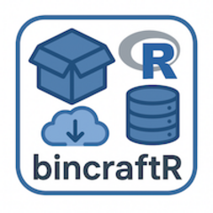

# bincraftR 

{bincraftR} provides the ability to build R package binaries for Linux.
It the core engine of the [rpkgs.com](https://rpkgs.com) project.

As of now, the package is only able to build CRAN packages, i.e. packages being mirrored on <https://github.com/cran>.
This will be made more flexible in future versions of the package. Contributions welcome!

Besides building binaries, the package optionally allows to store the build metadata (duration, version, name, errors, etc.) in a (Postgres) database.

> [!NOTE]
> The package is absolutely unoptimized with respect to the amount of dependencies and other efficienty aspects.
> The primary focus was on functionality and robustness during runtime.

> [!NOTE]
> The package must be run within the desired distribution for which binaries should be built for.
> See [rpkgs/build-cran-binaries/docker](https://codefloe.com/rpkgs/build-cran-binaries/src/branch/main/docker) for containerfiles which have been built for this purpose.

See the [pkgdown documentation](https://bincraftr.doc.rpkgs.com) for more details.
